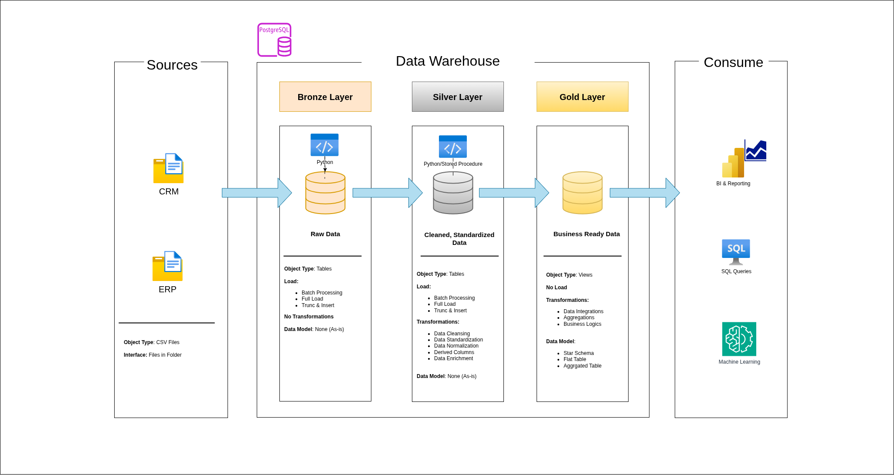
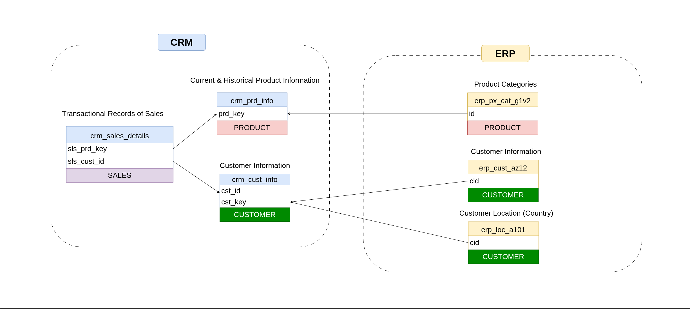
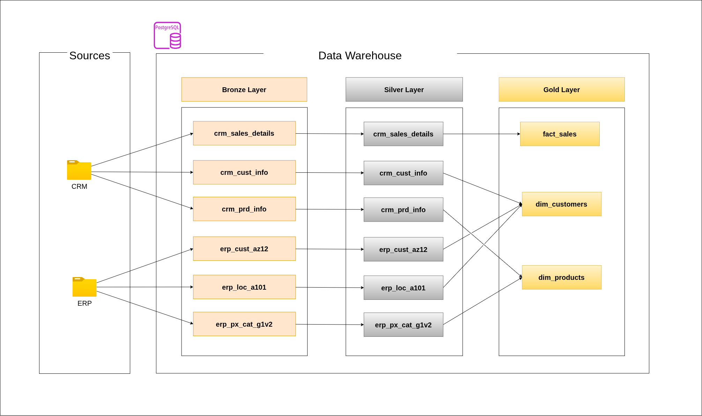
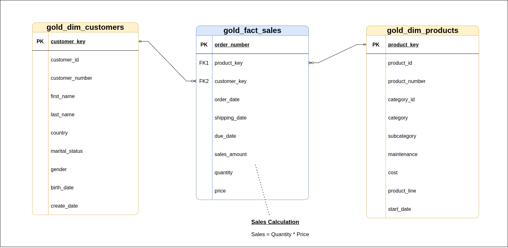

# Data Warehouse Project

Welcome to my **Data Warehouse Project** repository!  
This project demonstrates a comprehensive data warehousing solution built using PostgreSQL (Could easily be done using T-SQL). I used PostgreSQL because it serves as an excellent, cost-effective data warehouse for small-to-moderate datasets (up to ~1–2 TB) or prototyping, offering ACID compliance, robust SQL, JSONB support, and partitioning.

---
##  Data Architecture

The data architecture for this project follows Medallion Architecture **Bronze**, **Silver** and **Gold** layers:



1. **Bronze Layer**: Stores raw data as-is from the source systems. Data is ingested from CSV Files into the database.
2. **Silver Layer**: This layer includes data cleansing, standardization, and normalization processes to prepare data for analysis.
3. **Gold Layer**: Houses business-ready data modeled into a star schema required for reporting and analytics.

---
## Project Overview

This project involves:

1. **Data Architecture**: Designing a Modern Data Warehouse Using Medallion Architecture **Bronze**, **Silver**, and **Gold** layers.
2. **ETL Pipelines**: Extracting, transforming, and loading data from source systems into the warehouse.
3. **Data Modeling**: Developing fact and dimension tables optimized for analytical queries.

This repository showcases expertise in:
- SQL Development
- Data Architect
- Data Engineering  
- ETL Pipeline Development 
- Data Modeling

---

## Project Requirements

### Building the Data Warehouse (Data Engineering)

#### Objective
Develop a modern data warehouse using PostgreSQL Server to consolidate sales data, enabling analytical reporting and informed decision-making.

#### Specifications
- **Data Sources**: Import data from two source systems (ERP and CRM) provided as CSV files.
- **Data Quality**: Cleanse and resolve data quality issues prior to analysis.
- **Integration**: Combine both sources into a single, user-friendly data model designed for analytical queries.
- **Scope**: Focus on the latest dataset only; historization of data is not required.
- **Documentation**: Provide clear documentation of the data model to support both business stakeholders and analytics teams.

#### My Environment
- **Ubuntu 24.04.4 LTS**
- **PostgreSQL 16.13**
- **pgAdmin 4 9.13**
- **Python 3.12.3**

---

## Repository Structure
```
data_warehouse/
│
├── datasets/                           # Raw datasets used for the project (ERP and CRM data)
│
├── documents/                               # Project documentation and architecture details
│   ├── High_Level_Architecture.drawio        # Draw.io file shows the project's architecture
│   ├── Data_Catalog.md                 # Catalog of Gold Layer datasets, including field descriptions and metadata
│   ├── Data_Flow.drawio                # Draw.io file for the data flow diagram
│   ├── Data_Model.drawio              # Draw.io file for data models (star schema)
│   ├── Integration_Model.drawio           # Draw.io file that shows the relationship between the CRM and ERP
│
├── scripts/                            # SQL scripts for ETL and transformations
│   ├── bronze/                         # Scripts for extracting and loading raw data
│   ├── silver/                         # Scripts for cleaning and transforming data
│   ├── gold/                           # Scripts for creating analytical models
│
├── tests/                              # Data quality files
│
├── README.md                           # Project overview and instructions
├── LICENSE                             # License information for the repository
└── .gitignore                          # Files and directories to be ignored by Git
```
---
## Integration Model




---
## Data Flow



---
## Data Model



---
## Data Ingestion

Since my data warehouse is built on PostgreSQL, Python served as the primary tool for data integration. I used a Jupyter Notebook to explore the source material before importing the full contents of the CRM and ERP directories.

* The load code for the Bronze Layer can be found [here](scripts/bronze/Load.ipynb). 
* For the Silver Layer, I opted for a hybrid approach: a Python notebook available [here](scripts/silver/Load.ipynb) orchestrates the data load by executing a dedicated PostgreSQL stored [procedure](scripts/silver/load_stored_procedure.sql) whenever a refresh is required.

---
## References

Shoutout to Baraa Khatib Salkini for the inspiration. Be sure to check out his YouTube [channel](https://www.youtube.com/@DataWithBaraa)